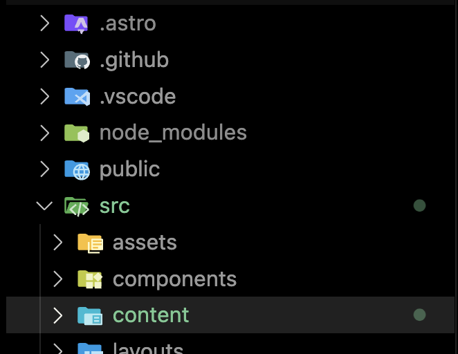
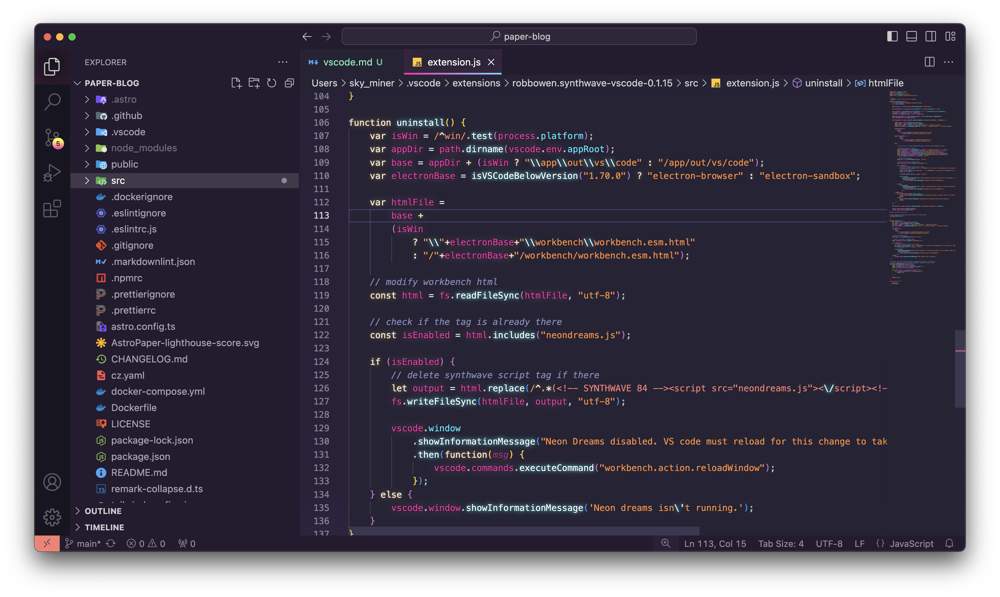
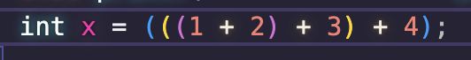
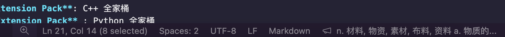

# VSCode 配置记录

之前的 VScode 看腻了，并且装了太多的插件过于臃肿。趁着这次机会，“重构”一下 VScode 插件和相关的美化。

~~时刻保持新鲜感还是很重要的~~

顺便可以记录一下我在 VScode 上面的插件，和最终的美化效果

### 界面篇

#### Material Icon Theme

应该属于是必备插件了，可以给左侧界面栏提供好看的图标。

#### Dark SynthWave '84 - VS Code theme

接下来就是十分重要的部分 —— VScode主题，之前一直在用 Github Dark。这次想尝试一个新的 theme。这个 theme 主要吸引我的点是这个主题的霓虹灯效果。

*其实现在又换回 Github Dark 了，这个 Theme 看久了眼睛累*

---

### 插件篇

#### 语言支持

- **C/C++ Extension Pack**: C++ 全家桶
- **Python Extension Pack** : Python 全家桶
- **rust** : 全家桶确实名字就叫做 rust
- **Markdown All in One** : markdown 全家桶

#### Remote Development

因为有远程连接服务器的需求，所以 VScode 的远程插件也需要配齐

#### GitHub 全家桶

- **GitHub Pull Requests**: 在 VScode 中处理 PR
- **GitHub Copilot**: AI 时代
- **GitHub Copilot Chat**: AI 时代
- **GitHub Actions**: GitHub workflow 解放双手

#### Path Intellisense

可以自动在编写本地路径时进行补齐

---

### 设置篇

VScode 本身的设置也需要一些修正！

#### 给括号上色

`@id:editor.bracketPairColorization.enabled @id:editor.guides.bracketPairs`

修改配置为 **True** 来启用彩色括号。在多个括号堆叠的时候可以很好区分。

#### 字体修改

`terminal.integrated.fontFamily`

因为我的 zsh 使用了一些**神奇**的字符，所以需要把终端字体修改为 `BitstromWera Nerd Font Propo` 才能正常显示这些奇妙的字符。当然这个字体也是需要安装的([神秘链接](https://www.nerdfonts.com/font-downloads))。也可以挑选其他喜欢的字体。

---

### 杂项

#### 翻译(英汉词典)

