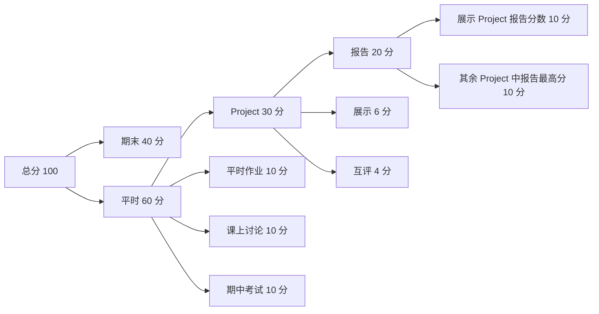
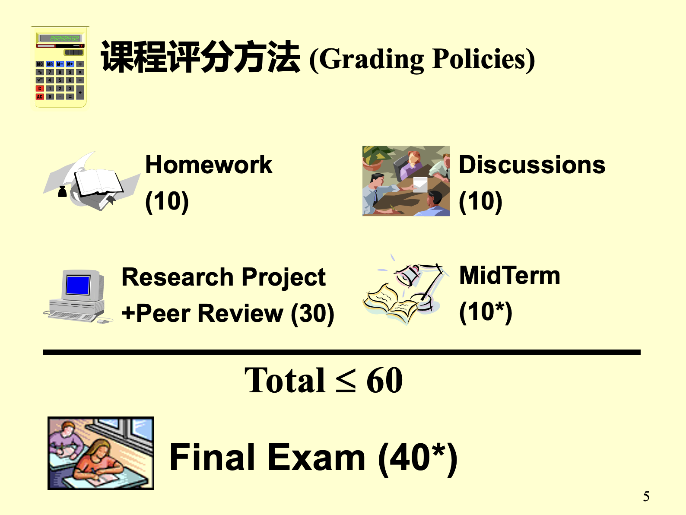

# ADS 课程评分细则与评分程序

> 做了三次 ADS 助教，每一次介绍评分规则的时候都感觉这个规则十分复杂。



首先我们引用 PPT 原文：



期末考试与平时分数是 4:6 的比例，这是一门平时分占比还是很高的科目。一般来说，ADS 过与不过主要就是看期末考试的分数能否达标，因为 ADS 的期末考试存在斩杀线，如果**期末考试分数不足 40 分会挂科**。只要超过了这个分数线助教一般来说不会给挂科了。

---

## 平时分构成

当然期末考试不在本文的主要介绍范围内，本文主要介绍平时分的组成：

- Homework: 每周一次的作业，共 15 次，每次时长一周，在 PTA 上完成。每次课程都对应着一次作业，所以上完课之后就要想着需要完成这次的课程作业。共占总评 10 分。
- Discussion: 老师课上会布置的**随堂问题**，理论上来说需要写在纸上并**当堂提交**。为了方便收集，有的班级会将这个过程同样放到 PTA 上。一般来说 Discussion 是提交即满分，是签到性质的任务。有很多同学在 Discussion 上扣许多分数，其实这部分是最容易获得的分数。
- MidTerm: 期中考试，期中考试占比相对来说很低，而且**可以被期末考试覆盖**。例如期中考试得分 60，期末考试得分 92，那么期中考试会按照 92 计算计入成绩。
- Project: 小组报告，这部分是最为复杂的评分部分，容我细细道来...

### Project 分数构成

Project 是 ADS 课程中的小组 Project，共 8 个 Project，每个 Project 两周时间。同学需要最多三人一组组队完成 Project，组队名单会在第一次 Project 开始前确定，确定后无法变更。在每个报告期间，同学们需要完成报告、代码、评阅他人报告代码、上台展示、修改并提交最终版等流程。每个小组需要完整参与某一个 Project 的全部流程（包括上台展示），部分参与另一个 Project 的部分流程（除上台展示之外的全过程），并参与**所有 Project 的评阅他人报告代码**流程才可以获得全部的分数。

Project 部分共占平时分 30 分，并由三部分构成

- Report: 报告分数 20 分。由小组参与的两次 Project 的报告得分平均分的来。
- Presentation: 展示 6 分。小组上台展示时，其他同学需要对该小组的展示内容进行打分。所有同学对展示打分的结果和助教打分结果的平均分作为该小组最终的展示得分。
- Peer Review: 互评 4 分。无论小组是否提交某个 Project 的报告，该小组都应该对此次 Project 其他组提交的报告进行打分。如果互评中所给出的分数触发仲裁机制后与仲裁结果差距过大会扣除部分互评分，扣完此次的互评分为止。平均到 8 次 Project 中，每次互评占总评 0.5 分。

### Bonus

Bonus 指的是同学完成了课程评分规则中所未要求的额外部分得到的加分。ADS 的 Bonus 来源有两个：

- 老师额外给的 Bonus。老师给 Bonus 的理由比较随机，一般来说是同学在课上回答出来了较难的问题。或者同学为课程的学习提供了额外的资料~~让老师比较高兴~~。但是这个比较随机掉落。
- **额外完成更多的 Project**

前面其实有提到，每个小组规定中需要完成**至少两次 Project**报告提交。如果有小组完成三次及以上的话，那么多出来的部分就是 Bonus 了。

小组额外完成的 Project 的报告得分 / 20 会当作 Bonus 额外加入到平时分中。即如果额外做的 Project 在互评和最终提交阶段均获得了满分，那么就可以得到 1 分的 Bonus。

至此，ADS 课程的全部评分规则介绍结束。

---

## FAQ

??? info "如果我做了 4 个 Project，那么是取哪两次 Project Report 分数做平均呢？"
    取上台展示这次的 Project 和其余 Project 中最高的 Report 分数做平均。剩下的 Project 作为 Bonus。即永远是以分数最高的方式计算成绩。

??? info "互评具体是怎么进行的？"
    互评主要是“盲审”，即提交 PR 版本的报告时需要隐去报告中的全部姓名、组号。注意文件属性和 PDF 文档属性中的姓名与组号都需要隐去。一旦能够通过常规手段发现报告中**直接暴露**了姓名或组别，则会直接失去这部分分数。

??? info "诚信守则是什么？"
    诚信守则不包含在评分中，所有同学都需要满分通过诚信守则才可以参加考试。如果一次不过可以有下一次，主要作用应该是告知同学们哪些行为是违反规定的。

??? info "能否参加多次展示？有没有额外加分？"
    不能，每个小组只能也只需要展示一次

??? info "两人队或者 Solo 完成 Project 有没有额外加分？"
    不能，课程组不鼓励单人或者双人队。所以不会有加分？

??? info "能否补交作业？"
    建议问课程助教。每个班对补交的规定不一样。

---

## 助教区

为了方便统计成绩，我写了一个 Python 程序（还是不会用 Excel 导致的）来完成对 Project 分数的统计与小组成绩的分发。

该程序基于该表结构[点击下载](assets/test.xlsx)实现，可供参考。

=== "Project成绩统计.py"

    ```python
    import openpyxl
    from openpyxl.utils import get_column_letter

    # 计算 Project 成绩
    def calc_group_scores(input_file, sheet_name, start_row, end_row, first_total, col_duration, project_num, target_report, target_bonus):
        wb = openpyxl.load_workbook(input_file)
        sheet = wb[sheet_name]
        for row in range(start_row, end_row + 1):
            # 报告总分的 pre 项目，和其余项目的报告分数统计
            pre_total, max_total, sum_total = 0, 0, 0
            # pre 展示分数，PR 分数统计
            pre_score_sum, PR_score_sum = 0, 0
            col_number = [first_total + i*col_duration for i in range(project_num)] 
            for col in col_number:
                total_val = (float(sheet.cell(row=row, column=col-1).value) + float(sheet.cell(row=row, column=col-2).value)) / 2
                pre_score = float(sheet.cell(row=row, column=col+1).value)
                PR_score  = float(sheet.cell(row=row, column=col+2).value)
                
                if pre_score != 0:
                    pre_total += total_val
                else:
                    max_total = max(max_total, total_val)
                    sum_total += total_val
                pre_score_sum += pre_score
                PR_score_sum += PR_score
            sheet.cell(row=row, column=target_report).value = (pre_total + max_total) / 2
            sheet.cell(row=row, column=target_report+1).value = pre_score_sum
            sheet.cell(row=row, column=target_report+2).value = PR_score_sum / project_num / 10
            sheet.cell(row=row, column=target_bonus).value = (sum_total - max_total) / 20
        wb.save(input_file)

    input_file = 'result.xlsx'
    sheet_name = 'Sheet3'

    start_row = 3
    end_row = 19

    first_total = 11
    col_duration = 5
    project_num = 8

    target_report = 49
    target_bouns = 52

    calc_group_scores(input_file, sheet_name, start_row, end_row, first_total, col_duration, project_num, target_report, target_bouns)
    ```

=== "Project成绩分发.py"

    ```python
    import openpyxl
    from openpyxl.utils import get_column_letter

    # 统计小组成绩到总表(Sheet3 -> Sheet1)
    def calc_group_scores(input_file, 
                        sheet_total, total_id_col, total_score_col, total_bonus_col, total_start_row, total_end_row,
                        sheet_project, project_id_col, project_score_col, project_start_row, project_end_row):
        wb = openpyxl.load_workbook(input_file)
        sheet_project = wb[sheet_project]
        sheet_total = wb[sheet_total]
        id2score = dict()
        for row in range(project_start_row, project_end_row+1):
            for col in project_id_col:
                id2score[str(sheet_project.cell(row=row, column=col).value)] = (\
                    float(sheet_project.cell(row=row, column=project_score_col).value),   # report
                    float(sheet_project.cell(row=row, column=project_score_col+1).value), # pre
                    float(sheet_project.cell(row=row, column=project_score_col+2).value), # PR
                    float(sheet_project.cell(row=row, column=project_score_col+3).value)) # bonus
        for row in range(total_start_row, total_end_row+1):
            score = id2score[str(sheet_total.cell(row=row, column=total_id_col).value)]
            sheet_total.cell(row=row, column=total_score_col).value = score[0]
            sheet_total.cell(row=row, column=total_score_col+1).value = score[1]
            sheet_total.cell(row=row, column=total_score_col+2).value = score[2]
            sheet_total.cell(row=row, column=total_bonus_col).value = score[3]
        wb.save(input_file)
            
    input_file = 'result.xlsx'
    sheet_total = 'Sheet1'
    total_id_col = 1
    total_score_col = 43
    total_bonus_col = 11
    total_start_row = 2
    total_end_row = 50

    sheet_project = 'Sheet3'
    project_id_col = [3, 5, 7]
    project_score_col = 49
    project_start_row = 3
    project_end_row = 19

    calc_group_scores(input_file, 
                        sheet_total, total_id_col, total_score_col, total_bonus_col, total_start_row, total_end_row,
                        sheet_project, project_id_col, project_score_col, project_start_row, project_end_row)
        
    ```

